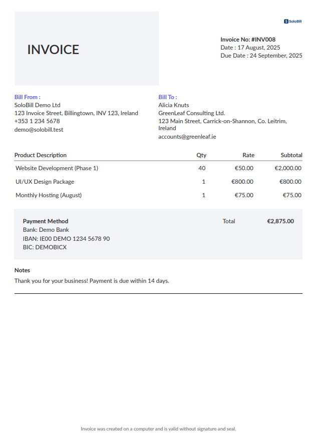

# SoloBill

A simple and modern invoice generator for freelancers

SoloBill is a web application built with **ASP.NET Core MVC**, **Entity Framework Core**, and **SQL Server** that helps freelancers and small businesses manage clients, create invoices, and export them as PDFs.

This project was built as part of my portfolio to demonstrate full-stack development skills, from database design to modern UI and PDF generation.

---

## Features

- **Client Management** – Add, edit, and search clients
- **Invoice Creation** – Dynamic form with line items, quantities, rates, and notes
- **Live Invoice Preview** – Two-column layout with collapsible form and real-time updates
- **Export to PDF** – Generate professional invoices using [QuestPDF](https://www.questpdf.com/)
- **Invoice Status** – Track _Paid_, _Unpaid_, and _Overdue_ invoices
- **Dashboard** – Overview of clients, invoices, and unpaid counts
- **Brand Styling** – Clean UI styled with Bootstrap and custom color palette

---

## Tech Stack

- **Backend:** ASP.NET Core MVC 8, Entity Framework Core
- **Frontend:** Bootstrap 5, custom CSS, JavaScript
- **Database:** SQL Server / LocalDB
- **Authentication:** ASP.NET Identity
- **PDF Generation:** QuestPDF
- **Environment:** Developed on macOS (ARM) with Visual Studio Code
- **Version Control:** Git & GitHub

---

## Screenshots

### Dashboard


### Invoice Form & Preview


### Invoice PDF



---

## Demo Video

[](assets/demo-small.mp4)

---

## Future Enhancements

- Add VAT and discount options for invoices
- Multi-user companies (team accounts)
- Improved reporting and analytics
- Mobile-friendly refinements (responsive dashboard and invoice view)
- Email integration (send invoices directly to clients)

---

## Getting Started

### Prerequisites

- [.NET 8 SDK](https://dotnet.microsoft.com/en-us/download)
- SQL Server (LocalDB or Azure SQL)

### Installation

1. Clone the repo:
   ```bash
   git clone https://github.com/paula-hickey/freelancer-invoice-generator.git
   cd freelancer-invoice-generator/SoloBill
   ```
